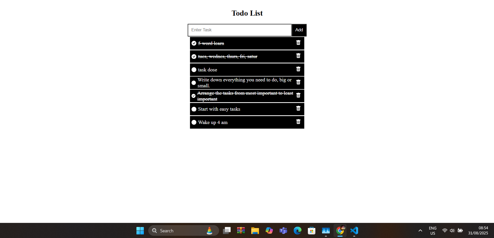
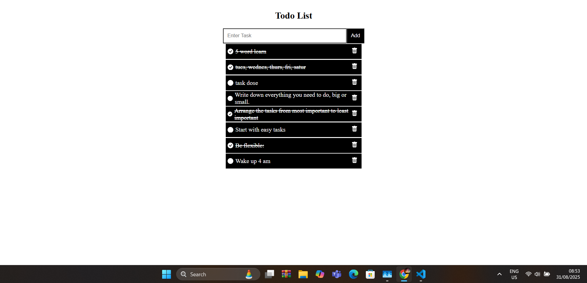

# Todolist-Backend

## About The Project

This project is an attempt to clone the Disney+ App. It is so far built with React, Redux Toolkit, React Router, Tanstack Query, Vite, styled components, Material UI, Framer Motion, Firebase, the TMDB API and other third-party libraries such as React Spinners. Moreover, it is fully responsive and follows the mobile-first concept.





## Key Features

### Home Page

- React.js.
- Node.js.
- CSS5.
- Express.js.
- MongoDB compress.


## Usage

Install the dependencies using npm

   ```bash
   npm install
   ```

To start the development server run the following command :

# Server back-end
```bash
cd Server

npm start 
```
# Todolist front-end
```bash
cd todolist

npm npm run dev 
```


